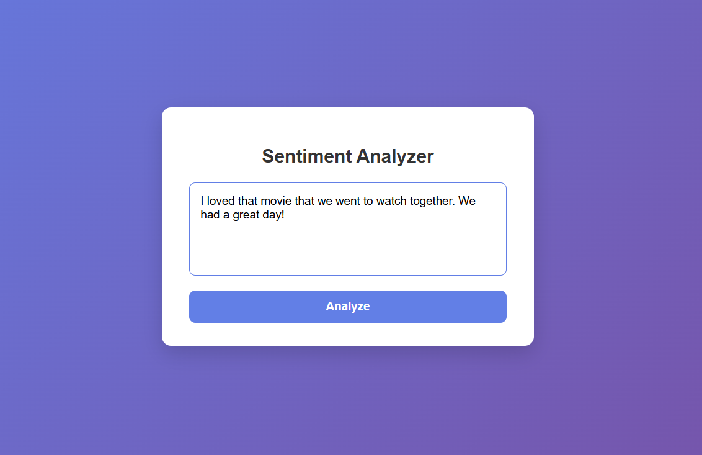
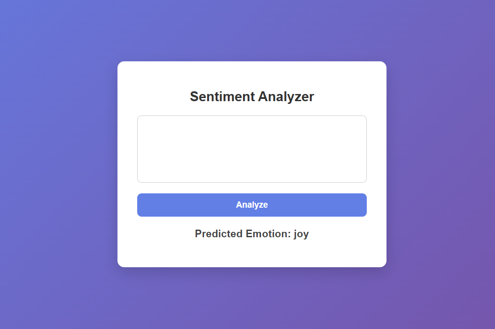

# Sentiment Analysis Web Application

## Overview
This project is a Flask-based web application that performs sentiment analysis on user-input text using machine learning and natural language processing (NLP). The application classifies text into positive or negative sentiment and displays the result through a web interface.

---

## Project Structure
```
.
├── app.py
├── preprocessing.py
├── sentiment_model.pkl
├── requirements.txt
├── Procfile
├── .gitignore
├── nltk_data/
│   ├── corpora/
│   ├── taggers/
│   └── tokenizers/
├── static/
│   └── style.css
├── templates/
│   └── index.html
└── venv/
└── screenshots/
│   ├── before.png
│   ├── after.png
```

---

## File Description

- **app.py** – Main Flask application handling routing and predictions  
- **preprocessing.py** – Text cleaning and preprocessing functions  
- **sentiment_model.pkl** – Trained sentiment analysis model  
- **requirements.txt** – Project dependencies  
- **Procfile** – Deployment configuration  
- **nltk_data/** – Required NLTK resources  
- **static/style.css** – Frontend styling  
- **templates/index.html** – Web interface template  

---

## Approach

- Text data is preprocessed using NLTK (cleaning, stopword removal, lemmatization)
- TF-IDF is used to convert text into numerical features
- A supervised machine learning model is trained for sentiment classification
- The trained model is integrated into a Flask web application

---

## How to Run Locally

1. Clone the repository
```
git clone https://github.com/aditirao29/Sentiment_analysis
cd sentiment
```
2. Create and activate a virtual environment
```
python -m venv venv
venv\Scripts\activate  # On Windows
```
3. Install dependencies
```
pip install -r requirements.txt
```
4. Run the flask app
```
python app.py
```
5. Open in browser
```
http://127.0.0.1:5000/
```


---

## Output
The user enters text into the application, and the predicted sentiment (positive or negative) is displayed on the screen.

---

## Screenshots
<p align="center">
  
  
</p>

---
## Conclusion
This project demonstrates a complete sentiment analysis pipeline, from preprocessing and feature extraction to model deployment using Flask.
